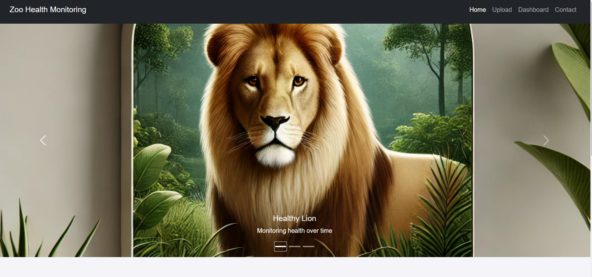

# Zoo Health Monitoring System

## Table of Contents
- [Features](#features)
- [Tools](#tools)
- [Photos](#photos)

## Features
- **Animal Health Tracking:** Allows zookeepers to monitor the health of animals over time.
- **Image Upload:** Enables the uploading of periodic images of animals for health assessment.
- **Image Comparison:** Compares new images with previous ones to detect changes in appearance.
- **Skin Issue Detection:** Utilizes image processing to identify potential skin issues based on uploaded images.
- **Health Alerts:** Sends notifications via email if significant changes in an animal's health are detected.
- **Database Integration:** Stores animal data and image records in a PostgreSQL database.

## Tools
- **Programming Languages:** Python, HTML, CSS, JavaScript
- **Frameworks:** Flask for backend, Bootstrap for frontend styling
- **Image Processing:** OpenCV for image comparison and analysis
- **Database:** PostgreSQL for data storage
- **Email Notifications:** smtplib for sending alerts
- **Virtual Environment:** venv for managing dependencies

## Photos

